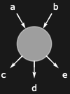

## Usage

<code>[SpiderDiagram](https://resources.wolframcloud.com/PacletRepository/resources/Wolfram/DiagrammaticComputation/ref/SpiderDiagram)[{$i_1$, ...}, {$o_1$, ...}]</code> creates a many-to-many junction with input ports $i_1, ...$ and output ports $o_1, ...$ all meeting at a single point.

## Details & Options

- A spider is the multi-port generalisation of <code>[IdentityDiagram](https://resources.wolframcloud.com/PacletRepository/resources/Wolfram/DiagrammaticComputation/ref/IdentityDiagram)</code>, <code>[CopyDiagram](https://resources.wolframcloud.com/PacletRepository/resources/Wolfram/DiagrammaticComputation/ref/CopyDiagram)</code>, <code>[MergeDiagram](https://resources.wolframcloud.com/PacletRepository/resources/Wolfram/DiagrammaticComputation/ref/MergeDiagram)</code>, <code>[CapDiagram](https://resources.wolframcloud.com/PacletRepository/resources/Wolfram/DiagrammaticComputation/ref/CapDiagram)</code> and <code>[CupDiagram](https://resources.wolframcloud.com/PacletRepository/resources/Wolfram/DiagrammaticComputation/ref/CupDiagram)</code> -- all of these are special cases.
- It is the basic structural junction in ZX-style and other process-theoretic calculi.
- Spiders fuse: two spiders meeting at a shared wire merge into a single spider whose legs are the union (this is the spider law).

## Basic Examples

A 2-to-3 spider:

```wl
SpiderDiagram[{a, b}, {c, d, e}]
```



## Properties and Relations

<code>[CopyDiagram](https://resources.wolframcloud.com/PacletRepository/resources/Wolfram/DiagrammaticComputation/ref/CopyDiagram)</code> is the special case 1-to-many; <code>[MergeDiagram](https://resources.wolframcloud.com/PacletRepository/resources/Wolfram/DiagrammaticComputation/ref/MergeDiagram)</code> is many-to-1; <code>[CapDiagram](https://resources.wolframcloud.com/PacletRepository/resources/Wolfram/DiagrammaticComputation/ref/CapDiagram)</code> is 2-to-0 and <code>[CupDiagram](https://resources.wolframcloud.com/PacletRepository/resources/Wolfram/DiagrammaticComputation/ref/CupDiagram)</code> is 0-to-2; <code>[IdentityDiagram](https://resources.wolframcloud.com/PacletRepository/resources/Wolfram/DiagrammaticComputation/ref/IdentityDiagram)</code> is 1-to-1.
