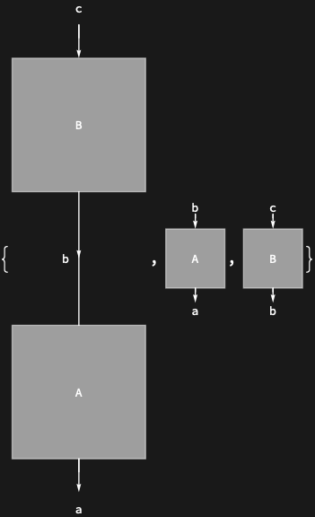

## Usage

<code>[DiagramCases](https://resources.wolframcloud.com/PacletRepository/resources/Wolfram/DiagrammaticComputation/ref/DiagramCases)[$d$, $patt$]</code> returns the subdiagrams of $d$ matching the <code>[DiagramPattern](https://resources.wolframcloud.com/PacletRepository/resources/Wolfram/DiagrammaticComputation/ref/DiagramPattern)</code> $patt$.

## Details & Options

- Behaves like <code>[Cases](https://reference.wolfram.com/language/ref/Cases.html)</code>, but matching is by diagram structure (via <code>[DiagramPattern](https://resources.wolframcloud.com/PacletRepository/resources/Wolfram/DiagrammaticComputation/ref/DiagramPattern)</code>).

## Basic Examples

Collect every singleton subdiagram:

```wl
DiagramCases[
  DiagramComposition[Diagram["A", b, a], Diagram["B", c, b]],
  DiagramPattern[_, {_}, {_}]
]
```


