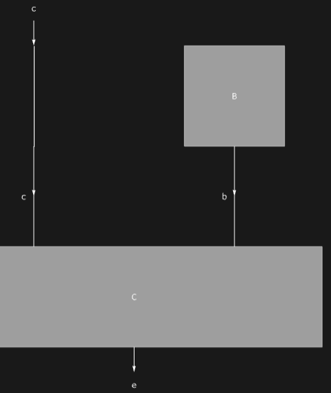

## Usage

<code>[DiagramDelete](https://resources.wolframcloud.com/PacletRepository/resources/Wolfram/DiagrammaticComputation/ref/DiagramDelete)[$d$, {$i$, $j$, …}]</code> deletes the subdiagram of $d$ at position {$i$, $j$, …}.

<code>[DiagramDelete](https://resources.wolframcloud.com/PacletRepository/resources/Wolfram/DiagrammaticComputation/ref/DiagramDelete)[$d$, {$pos_1$, $pos_2$, …}]</code> deletes the subdiagrams at all the positions $pos_i$.

## Details & Options

- Positions follow the <code>[DiagramPositions](https://resources.wolframcloud.com/PacletRepository/resources/Wolfram/DiagrammaticComputation/ref/DiagramPositions)</code> convention; the diagram analogue of <code>[Delete](https://reference.wolfram.com/language/ref/Delete.html)</code>.
- The containing composite is rebuilt without the deleted entries; a composite left with a single subdiagram normalizes to that subdiagram.

## Basic Examples

Drop the first stage of a composition; the remaining single stage normalizes to a plain diagram:

```wl
DiagramDelete[DiagramComposition[Diagram["A", b, a], Diagram["B", c, b]], {1}]
```


Delete one factor inside a nested product:

```wl
DiagramDelete[
  Diagram[DiagramProduct[Diagram["A", a, c], Diagram["B", b]] /* Diagram["C", {c, b}, e]],
  {2, 1}
]
```


