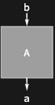

## Usage

<code>[DiagramDelete](https://resources.wolframcloud.com/PacletRepository/resources/Wolfram/DiagrammaticComputation/ref/DiagramDelete)[$d$, $position$]</code> deletes the subdiagram of $d$ at $position$.

## Details & Options

- Deletion does not break port matching; surrounding subdiagrams are reconnected as if the deleted piece had been replaced by an <code>[IdentityDiagram](https://resources.wolframcloud.com/PacletRepository/resources/Wolfram/DiagrammaticComputation/ref/IdentityDiagram)</code> of matching ports.

## Basic Examples

Drop the second subdiagram of a composition:

```wl
DiagramDelete[DiagramComposition[Diagram["A", b, a], Diagram["B", c, b]], {2}]
```


