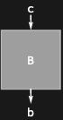

## Usage

<code>[DiagramExtract](https://resources.wolframcloud.com/PacletRepository/resources/Wolfram/DiagrammaticComputation/ref/DiagramExtract)[$d$, $position$]</code> extracts the subdiagram of $d$ at $position$.

## Basic Examples

Get the second subdiagram of a composition:

```wl
DiagramExtract[DiagramComposition[Diagram["A", b, a], Diagram["B", c, b]], {2}]
```


