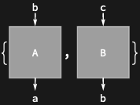
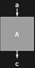

## Usage

<code>[DiagramExtract](https://resources.wolframcloud.com/PacletRepository/resources/Wolfram/DiagrammaticComputation/ref/DiagramExtract)[$d$, {$i$, $j$, …}]</code> extracts the subdiagram of $d$ at position {$i$, $j$, …}.

<code>[DiagramExtract](https://resources.wolframcloud.com/PacletRepository/resources/Wolfram/DiagrammaticComputation/ref/DiagramExtract)[$d$, {$pos_1$, $pos_2$, …}]</code> extracts the list of subdiagrams at positions $pos_i$.

## Details & Options

- Positions follow the <code>[DiagramPositions](https://resources.wolframcloud.com/PacletRepository/resources/Wolfram/DiagrammaticComputation/ref/DiagramPositions)</code> convention; the empty position <code>{}</code> extracts $d$ itself.
- The diagram analogue of <code>[Extract](https://reference.wolfram.com/language/ref/Extract.html)</code>.

## Basic Examples

Get the second subdiagram of a composition:

```wl
DiagramExtract[DiagramComposition[Diagram["A", b, a], Diagram["B", c, b]], {2}]
```


Extract several subdiagrams at once:

```wl
DiagramExtract[DiagramComposition[Diagram["A", b, a], Diagram["B", c, b]], {{1}, {2}}]
```



Reach into a nested diagram:

```wl
DiagramExtract[Diagram[DiagramProduct[Diagram["A", a, c], Diagram["B", b]] /* Diagram["C", {c, b}, e]], {2, 1}]
```


