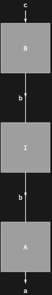
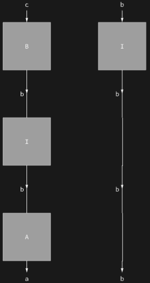

## Usage

<code>[DiagramInsert](https://resources.wolframcloud.com/PacletRepository/resources/Wolfram/DiagrammaticComputation/ref/DiagramInsert)[$d$, $sub$, {$i$, $j$, …}]</code> inserts the diagram $sub$ into $d$ so that it sits at position {$i$, $j$, …}, shifting the following siblings.

<code>[DiagramInsert](https://resources.wolframcloud.com/PacletRepository/resources/Wolfram/DiagrammaticComputation/ref/DiagramInsert)[$d$, $sub$, {$pos_1$, $pos_2$, …}]</code> inserts a copy of $sub$ at each of the positions $pos_i$.

## Details & Options

- Positions follow the <code>[DiagramPositions](https://resources.wolframcloud.com/PacletRepository/resources/Wolfram/DiagrammaticComputation/ref/DiagramPositions)</code> convention; the diagram analogue of <code>[Insert](https://reference.wolfram.com/language/ref/Insert.html)</code>.
- The insertion happens inside the composite (composition, product, sum or network) containing the position; the surrounding diagram is rebuilt with its original options.

## Basic Examples

Splice an identity-like diagram between the two stages of a composition:

```wl
DiagramInsert[
  DiagramComposition[Diagram["A", b, a], Diagram["B", c, b]],
  Diagram["I", b, b],
  {2}
]
```



Insert a copy in front of every stage:

```wl
DiagramInsert[
  DiagramComposition[Diagram["A", b, a], Diagram["B", c, b]],
  Diagram["I", b, b],
  {{1}, {2}}
]
```


