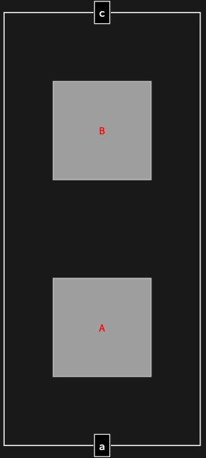

## Usage

<code>[DiagramMap](https://resources.wolframcloud.com/PacletRepository/resources/Wolfram/DiagrammaticComputation/ref/DiagramMap)[$f$, $d$]</code> applies the function $f$ to every subdiagram of $d$ and returns the rebuilt diagram.

## Details & Options

- Like <code>Map[$f$, $d$, Infinity]</code> but respecting diagram structure: $f$ is given a <code>[Diagram](https://resources.wolframcloud.com/PacletRepository/resources/Wolfram/DiagrammaticComputation/ref/Diagram)</code> and is expected to return a <code>[Diagram](https://resources.wolframcloud.com/PacletRepository/resources/Wolfram/DiagrammaticComputation/ref/Diagram)</code>.

## Basic Examples

Tag every subdiagram:

```wl
DiagramMap[Diagram[Style[#["Expression"], Red], ##2] &,
  DiagramComposition[Diagram["A", b, a], Diagram["B", c, b]]
]
```


