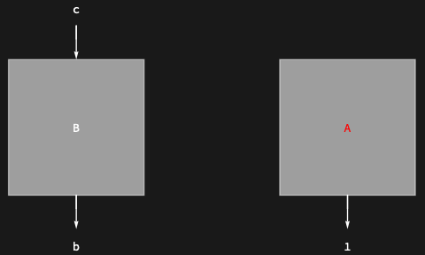

## Usage

<code>[DiagramMapAt](https://resources.wolframcloud.com/PacletRepository/resources/Wolfram/DiagrammaticComputation/ref/DiagramMapAt)[$f$, $d$, $positions$]</code> applies the function $f$ to the subdiagrams of $d$ at the given $positions$.

## Details & Options

- Positions follow the same convention as <code>[DiagramPositions](https://resources.wolframcloud.com/PacletRepository/resources/Wolfram/DiagrammaticComputation/ref/DiagramPositions)</code> / <code>[Position](https://reference.wolfram.com/language/ref/Position.html)</code>.
- $positions$ may be a single position or a list of positions.

## Basic Examples

Recolor only the first subdiagram:

```wl
DiagramMapAt[Diagram[Style[#["Expression"], Red], ##2] &,
  DiagramComposition[Diagram["A", b, a], Diagram["B", c, b]],
  {1}
]
```


