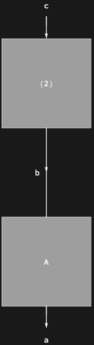

## Usage

<code>[DiagramMapAt](https://resources.wolframcloud.com/PacletRepository/resources/Wolfram/DiagrammaticComputation/ref/DiagramMapAt)[$f$, $d$, {$i$, $j$, …}]</code> applies $f$ to the subdiagram of $d$ at position {$i$, $j$, …}.

<code>[DiagramMapAt](https://resources.wolframcloud.com/PacletRepository/resources/Wolfram/DiagrammaticComputation/ref/DiagramMapAt)[$f$, $d$, {$pos_1$, $pos_2$, …}]</code> applies $f$ at all the positions $pos_i$.

<code>[DiagramMapAt](https://resources.wolframcloud.com/PacletRepository/resources/Wolfram/DiagrammaticComputation/ref/DiagramMapAt)[$f$, $pos$][$d$]</code> is the operator form.

## Details & Options

- $f$ receives two arguments — the subdiagram and its position — and its result is wrapped back into a <code>[Diagram](https://resources.wolframcloud.com/PacletRepository/resources/Wolfram/DiagrammaticComputation/ref/Diagram)</code>.
- Positions follow the <code>[DiagramPositions](https://resources.wolframcloud.com/PacletRepository/resources/Wolfram/DiagrammaticComputation/ref/DiagramPositions)</code> convention; the diagram analogue of <code>[MapAt](https://reference.wolfram.com/language/ref/MapAt.html)</code>.

## Basic Examples

Restyle only the second subdiagram:

```wl
DiagramMapAt[Diagram[#, "Shape" -> "Circle"] &, DiagramComposition[Diagram["A", b, a], Diagram["B", c, b]], {2}]
```


The function also receives the position:

```wl
DiagramMapAt[Diagram[#1, "Expression" -> ToString[#2]] &, DiagramComposition[Diagram["A", b, a], Diagram["B", c, b]], {2}]
```


