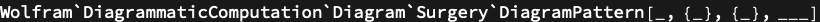

## Usage

<code>[DiagramPattern](https://resources.wolframcloud.com/PacletRepository/resources/Wolfram/DiagrammaticComputation/ref/DiagramPattern)[$expr$, $inputs$, $outputs$]</code> represents a diagram-shaped pattern for matching against subdiagrams.

## Details & Options

- A <code>[DiagramPattern](https://resources.wolframcloud.com/PacletRepository/resources/Wolfram/DiagrammaticComputation/ref/DiagramPattern)</code> is to <code>[Diagram](https://resources.wolframcloud.com/PacletRepository/resources/Wolfram/DiagrammaticComputation/ref/Diagram)</code> what a pattern with blanks is to an ordinary expression. The $expr$, $inputs$ and $outputs$ slots accept patterns (including <code>_</code>, <code>[Blank](https://reference.wolfram.com/language/ref/Blank.html)</code>, named patterns and conditionals).
- Used as the matcher in <code>[DiagramPosition](https://resources.wolframcloud.com/PacletRepository/resources/Wolfram/DiagrammaticComputation/ref/DiagramPosition)</code>, <code>[DiagramCases](https://resources.wolframcloud.com/PacletRepository/resources/Wolfram/DiagrammaticComputation/ref/DiagramCases)</code>, <code>[DiagramReplace](https://resources.wolframcloud.com/PacletRepository/resources/Wolfram/DiagrammaticComputation/ref/DiagramReplace)</code> and <code>[DiagramRule](https://resources.wolframcloud.com/PacletRepository/resources/Wolfram/DiagrammaticComputation/ref/DiagramRule)</code>.

## Basic Examples

Match any singleton diagram with one input and one output:

```wl
DiagramPattern[_, {_}, {_}]
```


