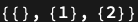

## Usage

<code>[DiagramPosition](https://resources.wolframcloud.com/PacletRepository/resources/Wolfram/DiagrammaticComputation/ref/DiagramPosition)[$d$, $patt$]</code> returns the positions of subdiagrams of $d$ matching the <code>[DiagramPattern](https://resources.wolframcloud.com/PacletRepository/resources/Wolfram/DiagrammaticComputation/ref/DiagramPattern)</code> $patt$.

## Details & Options

- Behaves like <code>[Position](https://reference.wolfram.com/language/ref/Position.html)</code>, but matching is by diagram structure (via <code>[DiagramPattern](https://resources.wolframcloud.com/PacletRepository/resources/Wolfram/DiagrammaticComputation/ref/DiagramPattern)</code>) rather than by raw expression.

## Basic Examples

Find every singleton subdiagram:

```wl
DiagramPosition[
  DiagramComposition[Diagram["A", b, a], Diagram["B", c, b]],
  DiagramPattern[_, {_}, {_}]
]
```


