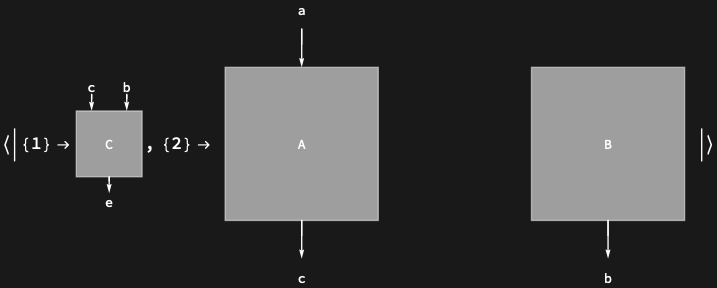

## Usage

<code>[DiagramPositions](https://resources.wolframcloud.com/PacletRepository/resources/Wolfram/DiagrammaticComputation/ref/DiagramPositions)[$d$]</code> returns an association of position → subdiagram for every subdiagram of $d$.

<code>[DiagramPositions](https://resources.wolframcloud.com/PacletRepository/resources/Wolfram/DiagrammaticComputation/ref/DiagramPositions)[$d$, $lvl$]</code> includes positions down to level $lvl$.

<code>[DiagramPositions](https://resources.wolframcloud.com/PacletRepository/resources/Wolfram/DiagrammaticComputation/ref/DiagramPositions)[$d$, {$min$, $max$}]</code> includes positions between levels $min$ and $max$.

## Details & Options

- Positions are integer-list addresses into the diagram's expression tree, in the same convention as <code>[Position](https://reference.wolfram.com/language/ref/Position.html)</code> and <code>[Extract](https://reference.wolfram.com/language/ref/Extract.html)</code>; the empty position <code>{}</code> is the diagram itself.
- The level specification follows the <code>[Level](https://reference.wolfram.com/language/ref/Level.html)</code> conventions: <code>{$lvl$}</code> is exactly level $lvl$, and negative levels count from the deepest position.

## Basic Examples

Positions of all subdiagrams, keyed to the subdiagrams:

```wl
DiagramPositions @ DiagramComposition[Diagram["A", b, a], Diagram["B", c, b]]
```


Only the immediate subdiagrams:

```wl
DiagramPositions[Diagram[DiagramProduct[Diagram["A", a, c], Diagram["B", b]] /* Diagram["C", {c, b}, e]], {1}]
```


