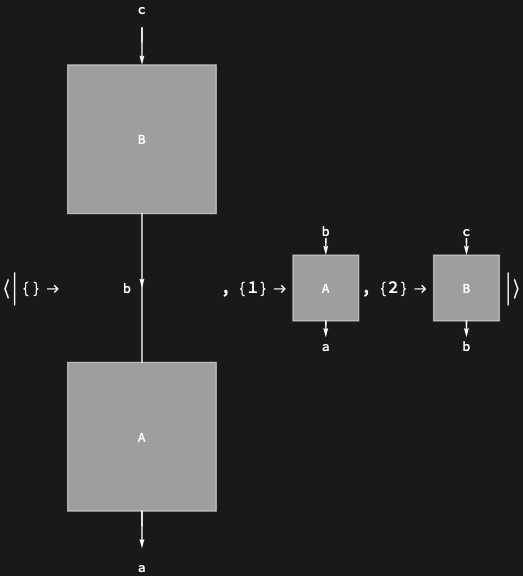

## Usage

<code>[DiagramPositions](https://resources.wolframcloud.com/PacletRepository/resources/Wolfram/DiagrammaticComputation/ref/DiagramPositions)[$d$]</code> returns the list of positions of every subdiagram of $d$.

## Details & Options

- Positions are integer-list addresses into the diagram's expression tree, in the same convention as <code>[Position](https://reference.wolfram.com/language/ref/Position.html)</code> and <code>[Extract](https://reference.wolfram.com/language/ref/Extract.html)</code> on Wolfram Language expressions.
- The empty position <code>{}</code> refers to the diagram itself.

## Basic Examples

List the positions of all subdiagrams:

```wl
DiagramPositions @ DiagramComposition[Diagram["A", b, a], Diagram["B", c, b]]
```


