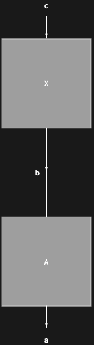

## Usage

<code>[DiagramReplacePart](https://resources.wolframcloud.com/PacletRepository/resources/Wolfram/DiagrammaticComputation/ref/DiagramReplacePart)[$d$, $position$ -> $new$]</code> replaces the subdiagram of $d$ at $position$ with $new$.

<code>[DiagramReplacePart](https://resources.wolframcloud.com/PacletRepository/resources/Wolfram/DiagrammaticComputation/ref/DiagramReplacePart)[$d$, {$pos_1$ -> $new_1$, $pos_2$ -> $new_2$, ...}]</code> replaces at several positions.

## Basic Examples

Swap out the second subdiagram:

```wl
DiagramReplacePart[
  DiagramComposition[Diagram["A", b, a], Diagram["B", c, b]],
  {2} -> Diagram["B'", c, b]
]
```


