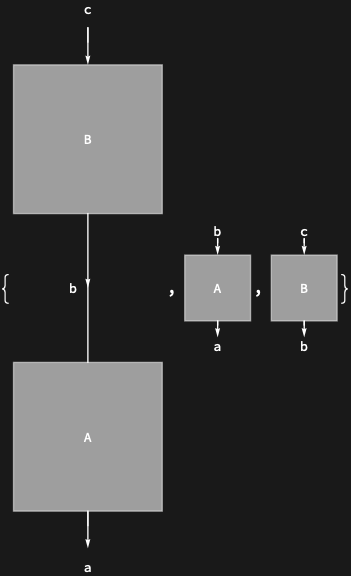
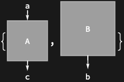

## Usage

<code>[DiagramSubdiagrams](https://resources.wolframcloud.com/PacletRepository/resources/Wolfram/DiagrammaticComputation/ref/DiagramSubdiagrams)[$d$]</code> returns a list of every subdiagram of $d$, including $d$ itself.

<code>[DiagramSubdiagrams](https://resources.wolframcloud.com/PacletRepository/resources/Wolfram/DiagrammaticComputation/ref/DiagramSubdiagrams)[$d$, $lvl$]</code> returns the subdiagrams down to level $lvl$.

<code>[DiagramSubdiagrams](https://resources.wolframcloud.com/PacletRepository/resources/Wolfram/DiagrammaticComputation/ref/DiagramSubdiagrams)[$d$, {$min$, $max$}]</code> returns the subdiagrams between levels $min$ and $max$.

## Details & Options

- The list is ordered by recursive descent through <code>[DiagramComposition](https://resources.wolframcloud.com/PacletRepository/resources/Wolfram/DiagrammaticComputation/ref/DiagramComposition)</code>, <code>[DiagramProduct](https://resources.wolframcloud.com/PacletRepository/resources/Wolfram/DiagrammaticComputation/ref/DiagramProduct)</code>, <code>[DiagramSum](https://resources.wolframcloud.com/PacletRepository/resources/Wolfram/DiagrammaticComputation/ref/DiagramSum)</code> and <code>[DiagramNetwork](https://resources.wolframcloud.com/PacletRepository/resources/Wolfram/DiagrammaticComputation/ref/DiagramNetwork)</code> — the values of <code>[DiagramPositions](https://resources.wolframcloud.com/PacletRepository/resources/Wolfram/DiagrammaticComputation/ref/DiagramPositions)</code>.
- <code>{1}</code> gives the immediate subdiagrams; level specifications follow the <code>[Level](https://reference.wolfram.com/language/ref/Level.html)</code> conventions.

## Basic Examples

List all subdiagrams of a composition:

```wl
DiagramSubdiagrams @ DiagramComposition[Diagram["A", b, a], Diagram["B", c, b]]
```



Only the deepest-level subdiagrams of a nested diagram:

```wl
DiagramSubdiagrams[Diagram[DiagramProduct[Diagram["A", a, c], Diagram["B", b]] /* Diagram["C", {c, b}, e]], {-1}]
```


