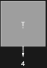
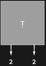
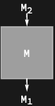
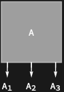
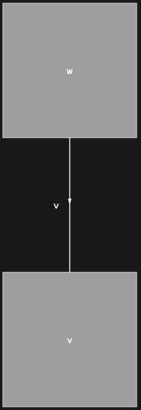

## Usage

<code>[TensorDiagram](https://resources.wolframcloud.com/PacletRepository/resources/Wolfram/DiagrammaticComputation/ref/TensorDiagram)[$tensor$]</code> represents the tensor expression $tensor$ as a diagram.

## Details & Options

- Numeric arrays become diagrams with their leg dimensions exposed as port types: a vector has one output, a matrix has one input and one output, a rank-$n$ array has $n$ ports.
- <code>[VectorSymbol](https://reference.wolfram.com/language/ref/VectorSymbol.html)</code>, <code>[MatrixSymbol](https://reference.wolfram.com/language/ref/MatrixSymbol.html)</code>, <code>[ArraySymbol](https://reference.wolfram.com/language/ref/ArraySymbol.html)</code> and <code>[ArrayDot](https://reference.wolfram.com/language/ref/ArrayDot.html)</code> / <code>[TensorContract](https://reference.wolfram.com/language/ref/TensorContract.html)</code> / <code>[TensorProduct](https://reference.wolfram.com/language/ref/TensorProduct.html)</code> expressions all lift into diagrams in the obvious way.

## Basic Examples

A vector (rank-1) becomes a diagram with one output:

```wl
TensorDiagram[{1, 2, 3, 4}]
```



A matrix (rank-2) becomes a diagram with one input and one output:

```wl
TensorDiagram[{{1, 2}, {3, 4}}]
```



Symbolic arrays lift directly:

```wl
TensorDiagram[MatrixSymbol[M, {3, 4}]]
```



```wl
TensorDiagram[ArraySymbol[A, {3, 4, 5}]]
```



Contracted tensor expressions become composite diagrams:

```wl
TensorDiagram[Dot[VectorSymbol[v, 2], VectorSymbol[w, 2]]]
```



## Properties and Relations

<code>[TensorDiagram](https://resources.wolframcloud.com/PacletRepository/resources/Wolfram/DiagrammaticComputation/ref/TensorDiagram)</code> is the inverse of <code>[DiagramTensor](https://resources.wolframcloud.com/PacletRepository/resources/Wolfram/DiagrammaticComputation/ref/DiagramTensor)</code>.
