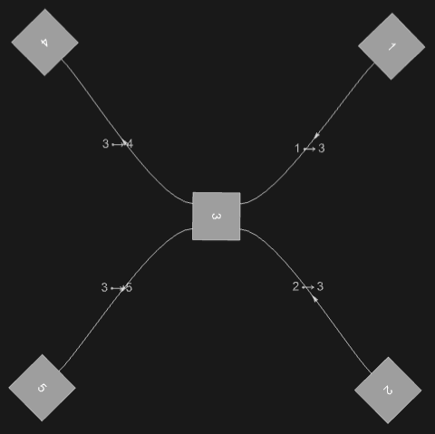
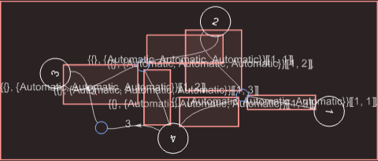
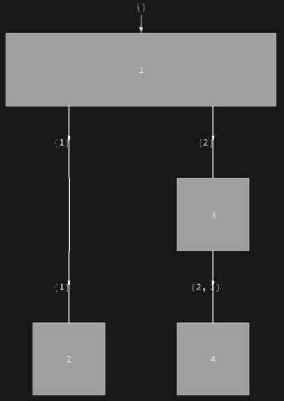
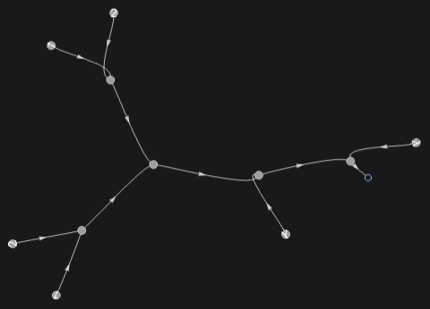
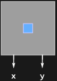

## Usage

<code>[ToDiagram](https://resources.wolframcloud.com/PacletRepository/resources/Wolfram/DiagrammaticComputation/ref/ToDiagram)[$obj$]</code> converts the object $obj$ into a <code>[Diagram](https://resources.wolframcloud.com/PacletRepository/resources/Wolfram/DiagrammaticComputation/ref/Diagram)</code>.

## Details & Options

- The conversion is dispatched on the head of $obj$. Supported inputs include:

| Input | Result |
|---|---|
| <code>Graph[...]</code> | network of identity-like diagrams whose port names are the vertices |
| <code>Tree[...]</code> | composition of branching diagrams following the tree's structure |
| hypergraph (list of edges) | network whose subdiagrams are the hyperedges |
| <code>NetGraph[...]</code> | network of diagrams whose ports are the named inputs/outputs of each node |
| <code>SystemModel[...]</code> / <code>.mo</code> import | network of subsystems with connector ports |
| <code>\[FormalLambda][...]</code> (lambda term) | network whose wiring encodes variable binding |
| <code>_Diagram</code> | the diagram itself |

## Basic Examples

Convert a <code>[Graph](https://reference.wolfram.com/language/ref/Graph.html)</code>:

```wl
ToDiagram[Graph[{1 -> 3, 2 -> 3, 3 -> 4, 3 -> 5}]]
```



Convert a hypergraph:

```wl
ToDiagram[{{1}, {1, 2}, {2, 3}, {1, 2, 3}}]
```



Convert a tree:

```wl
ToDiagram[Tree[1, {Tree[2, None], Tree[3, {Tree[4, None]}]}]]
```



Convert a lambda expression:

```wl
ToDiagram[\[FormalLambda][\[FormalLambda][1[2][2[1]]]]]
```



Convert a <code>[SystemModel](https://reference.wolfram.com/language/ref/SystemModel.html)</code> import:

```wl
ToDiagram[Import["ExampleData/ExampleModel.mo", "MO"]]
```



## Properties and Relations

<code>[ToDiagram](https://resources.wolframcloud.com/PacletRepository/resources/Wolfram/DiagrammaticComputation/ref/ToDiagram)</code> is the general-purpose entry point; <code>[TensorDiagram](https://resources.wolframcloud.com/PacletRepository/resources/Wolfram/DiagrammaticComputation/ref/TensorDiagram)</code> is the specialised conversion for tensor expressions.
