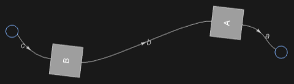

## Usage

<code>[ToDiagramNetwork](https://resources.wolframcloud.com/PacletRepository/resources/Wolfram/DiagrammaticComputation/ref/ToDiagramNetwork)[$d$]</code> rewrites a composite diagram $d$ as a <code>[DiagramNetwork](https://resources.wolframcloud.com/PacletRepository/resources/Wolfram/DiagrammaticComputation/ref/DiagramNetwork)</code>, exposing the port-name connectivity.

## Details & Options

- Flattens nested <code>[DiagramComposition](https://resources.wolframcloud.com/PacletRepository/resources/Wolfram/DiagrammaticComputation/ref/DiagramComposition)</code> and <code>[DiagramProduct](https://resources.wolframcloud.com/PacletRepository/resources/Wolfram/DiagrammaticComputation/ref/DiagramProduct)</code> structure into a single network whose subdiagrams are joined by shared port names.
- The reverse direction is implicit in <code>[DiagramArrange](https://resources.wolframcloud.com/PacletRepository/resources/Wolfram/DiagrammaticComputation/ref/DiagramArrange)</code>, which converts an arbitrary diagram into a layout-friendly form.

## Basic Examples

Convert a composite diagram to a network:

```wl
ToDiagramNetwork[DiagramComposition[Diagram["A", b, a], Diagram["B", c, b]]]
```


