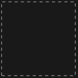

## Usage

<code>[ZeroDiagram](https://resources.wolframcloud.com/PacletRepository/resources/Wolfram/DiagrammaticComputation/ref/ZeroDiagram)[]</code> is the zero diagram -- the additive unit of <code>[DiagramSum](https://resources.wolframcloud.com/PacletRepository/resources/Wolfram/DiagrammaticComputation/ref/DiagramSum)</code>.

## Details & Options

- <code>[DiagramSum](https://resources.wolframcloud.com/PacletRepository/resources/Wolfram/DiagrammaticComputation/ref/DiagramSum)[$d$, [ZeroDiagram]()[]] == $d$</code>.
- Use it as the base case in additive recursions over diagrams.

## Basic Examples

```wl
ZeroDiagram[]
```


