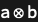
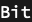

## Usage

<code>[Port](https://resources.wolframcloud.com/PacletRepository/resources/Wolfram/DiagrammaticComputation/ref/Port)[$expr$]</code> represents a symbolic port carrying the expression $expr$.

<code>[Port](https://resources.wolframcloud.com/PacletRepository/resources/Wolfram/DiagrammaticComputation/ref/Port)[$expr$, $type$]</code> assigns the port the type $type$.

<code>[Port](https://resources.wolframcloud.com/PacletRepository/resources/Wolfram/DiagrammaticComputation/ref/Port)[$expr$, $type$, $opts$]</code> attaches options to the port.

## Details & Options

- A <code>[Port](https://resources.wolframcloud.com/PacletRepository/resources/Wolfram/DiagrammaticComputation/ref/Port)</code> is the typed endpoint of a diagram. Diagrams compose by matching ports of compatible types.
- The default type is <code>\[FormalCapitalT]</code>, the generic placeholder type used when no further structure is given.
- The expression is held with <code>[HoldForm](https://reference.wolfram.com/language/ref/HoldForm.html)</code>-style semantics; reading a port out via its <code>"Expression"</code> property returns the original held form.
- Products and powers of ports are expanded automatically: <code>[Port](https://resources.wolframcloud.com/PacletRepository/resources/Wolfram/DiagrammaticComputation/ref/Port)[$p_1$ \[CircleTimes] $p_2$]</code> reduces to <code>[PortProduct](https://resources.wolframcloud.com/PacletRepository/resources/Wolfram/DiagrammaticComputation/ref/PortProduct)[[Port]()[$p_1$], [Port](https://resources.wolframcloud.com/PacletRepository/resources/Wolfram/DiagrammaticComputation/ref/Port)[$p_2$]]</code>, and <code>[Port](https://resources.wolframcloud.com/PacletRepository/resources/Wolfram/DiagrammaticComputation/ref/Port)[$p^n$]</code> to <code>[PortProduct](https://resources.wolframcloud.com/PacletRepository/resources/Wolfram/DiagrammaticComputation/ref/PortProduct)[[Port]()[$p$], ...]</code> with $n$ factors.
- The unit and zero ports are constructed by <code>[Port](https://resources.wolframcloud.com/PacletRepository/resources/Wolfram/DiagrammaticComputation/ref/Port)["1"]</code> and <code>[Port](https://resources.wolframcloud.com/PacletRepository/resources/Wolfram/DiagrammaticComputation/ref/Port)["0"]</code>.
- The following options can be given:

| Option | Default | Description |
|---|---|---|
| <code>"Type"</code> | <code>\[FormalCapitalT]</code> | type carried by the port |
| <code>"Tags"</code> | <code>{}</code> | list of tag annotations |
| <code>"NeutralQ"</code> | <code>[False]()</code> | whether the port is the unit for the product |

## Basic Examples

Construct a generic port:

```wl
Port[a]
```


Give the port an explicit type:

```wl
Port[a, "Real"]
```


Compose two ports into a product:

```wl
Port[a \[CircleTimes] b]
```



## Scope

A port can be queried for its properties:

```wl
p = Port[a, "Bit"];
p["Type"]
```



```wl
p["Expression"]
```


## Properties and Relations

<code>[Port](https://resources.wolframcloud.com/PacletRepository/resources/Wolfram/DiagrammaticComputation/ref/Port)</code> is the endpoint type used by <code>[Diagram](https://resources.wolframcloud.com/PacletRepository/resources/Wolfram/DiagrammaticComputation/ref/Diagram)</code>; <code>[PortDual](https://resources.wolframcloud.com/PacletRepository/resources/Wolfram/DiagrammaticComputation/ref/PortDual)</code> reverses direction, <code>[PortProduct](https://resources.wolframcloud.com/PacletRepository/resources/Wolfram/DiagrammaticComputation/ref/PortProduct)</code> combines them in parallel.
