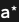
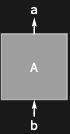
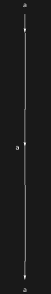

## Usage

<code>[PortDual](https://resources.wolframcloud.com/PacletRepository/resources/Wolfram/DiagrammaticComputation/ref/PortDual)[$p$]</code> represents the dual of the port $p$ — same expression and type, opposite direction.

<code>[PortDual](https://resources.wolframcloud.com/PacletRepository/resources/Wolfram/DiagrammaticComputation/ref/PortDual)[$expr$, $type$]</code> constructs a dual port directly from an expression and type.

## Details & Options

- An input port and its dual output port have the same name but opposite roles in composition: a <code>[Diagram](https://resources.wolframcloud.com/PacletRepository/resources/Wolfram/DiagrammaticComputation/ref/Diagram)</code> accepting input <code>[Port](https://resources.wolframcloud.com/PacletRepository/resources/Wolfram/DiagrammaticComputation/ref/Port)[$a$]</code> connects to one producing output <code>[PortDual](https://resources.wolframcloud.com/PacletRepository/resources/Wolfram/DiagrammaticComputation/ref/PortDual)[$a$]</code>.
- <code>[PortDual](https://resources.wolframcloud.com/PacletRepository/resources/Wolfram/DiagrammaticComputation/ref/PortDual)</code> is an involution: <code>[PortDual](https://resources.wolframcloud.com/PacletRepository/resources/Wolfram/DiagrammaticComputation/ref/PortDual)[[PortDual]()[$p$]] == $p$</code>.
- For composite ports, duality distributes: <code>[PortDual](https://resources.wolframcloud.com/PacletRepository/resources/Wolfram/DiagrammaticComputation/ref/PortDual)[[PortProduct]()[$p_1$, $p_2$]] == [PortProduct](https://resources.wolframcloud.com/PacletRepository/resources/Wolfram/DiagrammaticComputation/ref/PortProduct)[[PortDual]()[$p_2$], [PortDual](https://resources.wolframcloud.com/PacletRepository/resources/Wolfram/DiagrammaticComputation/ref/PortDual)[$p_1$]]</code> (note the reversal).

## Basic Examples

Build a dual port:

```wl
PortDual[a]
```



A dual port is outgoing as an input and ingoing as an output:

```wl
Diagram["A", PortDual[a], PortDual[b]]
```



## Scope

Composing a port with its dual produces a closed wire:

```wl
DiagramComposition[IdentityDiagram[a], IdentityDiagram[a]]
```



## Properties and Relations

<code>[PortDual](https://resources.wolframcloud.com/PacletRepository/resources/Wolfram/DiagrammaticComputation/ref/PortDual)</code> is the port-level analogue of <code>[DiagramDual](https://resources.wolframcloud.com/PacletRepository/resources/Wolfram/DiagrammaticComputation/ref/DiagramDual)</code>.
