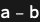

## Usage

<code>[PortMinus](https://resources.wolframcloud.com/PacletRepository/resources/Wolfram/DiagrammaticComputation/ref/PortMinus)[$p$]</code> represents the additive inverse of the port $p$ inside a <code>[PortSum](https://resources.wolframcloud.com/PacletRepository/resources/Wolfram/DiagrammaticComputation/ref/PortSum)</code>.

## Details & Options

- <code>[PortMinus](https://resources.wolframcloud.com/PacletRepository/resources/Wolfram/DiagrammaticComputation/ref/PortMinus)</code> is used to express formal subtractions in a port sum; <code>[Port](https://resources.wolframcloud.com/PacletRepository/resources/Wolfram/DiagrammaticComputation/ref/Port)[$a$ - $b$]</code> normalises to <code>[PortSum](https://resources.wolframcloud.com/PacletRepository/resources/Wolfram/DiagrammaticComputation/ref/PortSum)[[Port]()[$a$], [PortMinus](https://resources.wolframcloud.com/PacletRepository/resources/Wolfram/DiagrammaticComputation/ref/PortMinus)[[Port]()[$b$]]]</code>.
- Sequential negation is involutive: <code>[PortMinus](https://resources.wolframcloud.com/PacletRepository/resources/Wolfram/DiagrammaticComputation/ref/PortMinus)[[PortMinus]()[$p$]] == $p$</code>.

## Basic Examples

Build a signed port sum:

```wl
Port[a - b]
```


