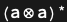

## Usage

<code>[PortPower](https://resources.wolframcloud.com/PacletRepository/resources/Wolfram/DiagrammaticComputation/ref/PortPower)[$p$, $n$]</code> represents the $n$-fold product of the port $p$ with itself.

## Details & Options

- For a non-negative integer $n$, <code>[Port](https://resources.wolframcloud.com/PacletRepository/resources/Wolfram/DiagrammaticComputation/ref/Port)[$p^n$]</code> expands to <code>[PortProduct](https://resources.wolframcloud.com/PacletRepository/resources/Wolfram/DiagrammaticComputation/ref/PortProduct)[$p$, $p$, …]</code> with $n$ factors.
- For a negative integer $n$, the expansion uses <code>[PortDual](https://resources.wolframcloud.com/PacletRepository/resources/Wolfram/DiagrammaticComputation/ref/PortDual)[$p$]</code> repeated <code>|n|</code> times.

## Basic Examples

A port tensored with itself three times:

```wl
Port[a^3]
```


A negative power dualises:

```wl
Port[a^-2]
```


