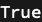
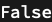

## Usage

<code>[PortQ](https://resources.wolframcloud.com/PacletRepository/resources/Wolfram/DiagrammaticComputation/ref/PortQ)[$expr$]</code> gives <code>[True](https://reference.wolfram.com/language/ref/True.html)</code> if $expr$ is a valid <code>[Port](https://resources.wolframcloud.com/PacletRepository/resources/Wolfram/DiagrammaticComputation/ref/Port)</code> and <code>[False](https://reference.wolfram.com/language/ref/False.html)</code> otherwise.

## Details & Options

- <code>[PortQ](https://resources.wolframcloud.com/PacletRepository/resources/Wolfram/DiagrammaticComputation/ref/PortQ)</code> returns <code>[True](https://reference.wolfram.com/language/ref/True.html)</code> only for objects constructed via the public <code>[Port](https://resources.wolframcloud.com/PacletRepository/resources/Wolfram/DiagrammaticComputation/ref/Port)</code>, <code>[PortDual](https://resources.wolframcloud.com/PacletRepository/resources/Wolfram/DiagrammaticComputation/ref/PortDual)</code>, <code>[PortProduct](https://resources.wolframcloud.com/PacletRepository/resources/Wolfram/DiagrammaticComputation/ref/PortProduct)</code>, <code>[PortSum](https://resources.wolframcloud.com/PacletRepository/resources/Wolfram/DiagrammaticComputation/ref/PortSum)</code> etc. constructors -- it checks structural validity, not just the head.
- Use it as a guard in patterns and option checks (e.g. <code>_? PortQ</code>).

## Basic Examples

A constructed port is valid:

```wl
PortQ[Port[a]]
```



Anything else is not:

```wl
PortQ["hello"]
```


