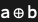

## Usage

<code>[PortSum](https://resources.wolframcloud.com/PacletRepository/resources/Wolfram/DiagrammaticComputation/ref/PortSum)[$p_1$, $p_2$, …]</code> represents the direct sum of the ports $p_i$.

## Details & Options

- The sum of ports is again a port whose type is the <code>[CirclePlus](https://reference.wolfram.com/language/ref/CirclePlus.html)</code> of the component types.
- <code>[PortSum](https://resources.wolframcloud.com/PacletRepository/resources/Wolfram/DiagrammaticComputation/ref/PortSum)</code> is associative; the unit is the zero port <code>[Port](https://resources.wolframcloud.com/PacletRepository/resources/Wolfram/DiagrammaticComputation/ref/Port)["0"]</code>.
- The infix shorthand <code>$p_1$ \[CirclePlus] $p_2$</code> evaluated inside <code>[Port](https://resources.wolframcloud.com/PacletRepository/resources/Wolfram/DiagrammaticComputation/ref/Port)</code> produces a <code>[PortSum](https://resources.wolframcloud.com/PacletRepository/resources/Wolfram/DiagrammaticComputation/ref/PortSum)</code>.

## Basic Examples

Build a sum of two ports:

```wl
Port[a \[CirclePlus] b]
```



## Properties and Relations

<code>[PortSum](https://resources.wolframcloud.com/PacletRepository/resources/Wolfram/DiagrammaticComputation/ref/PortSum)</code> is the port-level analogue of <code>[DiagramSum](https://resources.wolframcloud.com/PacletRepository/resources/Wolfram/DiagrammaticComputation/ref/DiagramSum)</code> — taking the direct sum of two diagrams matches their input and output port sums.
