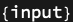

## Usage

<code>[TagPort](https://resources.wolframcloud.com/PacletRepository/resources/Wolfram/DiagrammaticComputation/ref/TagPort)[$p$, $tag$]</code> attaches the tag $tag$ to the port $p$.

<code>[TagPort](https://resources.wolframcloud.com/PacletRepository/resources/Wolfram/DiagrammaticComputation/ref/TagPort)[$p$, {$tag_1$, $tag_2$, …}]</code> attaches a list of tags.

## Details & Options

- Tags are user-defined annotations stored in the port's <code>"Tags"</code> option. They are preserved by diagram composition and surgery but do not affect type matching.
- Multiple tags accumulate: a second call adds to the existing tag list rather than replacing it.

## Basic Examples

Tag a port with a role:

```wl
TagPort[Port[a], "input"]
```


```wl
TagPort[Port[a], "input"]["Tags"]
```


