A gallery of worked examples: modeling a recipe as a dataflow diagram, building sorting networks from permutations, round-tripping between diagrams and symbolic tensors, and viewing trees and graphs as diagram grids.

```wl
<< Wolfram`DiagrammaticComputation`
```

## A Recipe as a Dataflow

Any process whose steps consume and produce named resources is a diagram. The classic tiramisu cream:

```wl
{
  egg = Diagram["Crack Egg", "egg", {"white", "yolk"}],
  beat = Diagram["Beat", {"yolk", "yolk", "sugar"}, "yolky paste"],
  whisk = Diagram["Whisk", {"white", "white"}, "whisked whites"],
  stir = Diagram["Stir", {"yolky paste", "mascarpone"}, "thick paste"],
  fold = Diagram["Fold", {"whisked whites", "thick paste"}, "crema di mascarpone"]
}
```

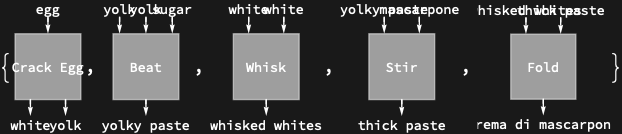

Stack the steps with <code>[ColumnDiagram](https://resources.wolframcloud.com/PacletRepository/resources/Wolfram/DiagrammaticComputation/ref/ColumnDiagram)</code> and <code>[RowDiagram](https://resources.wolframcloud.com/PacletRepository/resources/Wolfram/DiagrammaticComputation/ref/RowDiagram)</code>; matching resource names wire automatically:

```wl
ColumnDiagram[{
  RowDiagram[{egg, egg, IdentityDiagram["sugar"]}],
  RowDiagram[{whisk, beat}],
  stir,
  fold
}]
```

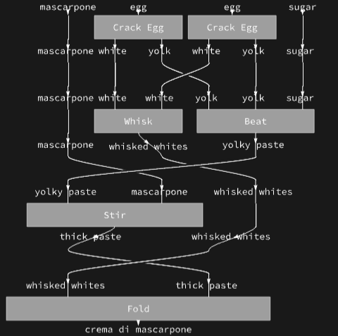

## Sorting Networks

A bubble sort is a stack of adjacent transpositions. Start from an unsorted row of labelled wires:

```wl
init = RowDiagram[MapIndexed[Diagram[#2[[1]], #1] &, {C, B, A}]]
```

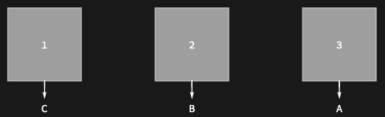

Each comparison-swap is a <code>[PermutationDiagram](https://resources.wolframcloud.com/PacletRepository/resources/Wolfram/DiagrammaticComputation/ref/PermutationDiagram)</code>:

```wl
PermutationDiagram[{B, A} -> {A, B}]
```

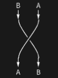

Stacking the three swaps sorts the wires:

```wl
sortNetwork = ColumnDiagram[{
  init,
  PermutationDiagram[{B, A} -> {A, B}],
  PermutationDiagram[{C, A} -> {A, C}],
  PermutationDiagram[{C, B} -> {B, C}]
}, "Rotate" -> Pi/2]
```

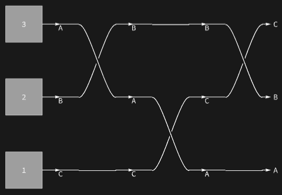

Since the network is nothing but wires, <code>[SimplifyDiagram](https://resources.wolframcloud.com/PacletRepository/resources/Wolfram/DiagrammaticComputation/ref/SimplifyDiagram)</code> contracts it to the overall permutation:

```wl
SimplifyDiagram[ColumnDiagram[{
  PermutationDiagram[{B, A} -> {A, B}],
  PermutationDiagram[{C, A} -> {A, C}],
  PermutationDiagram[{C, B} -> {B, C}]
}]]
```

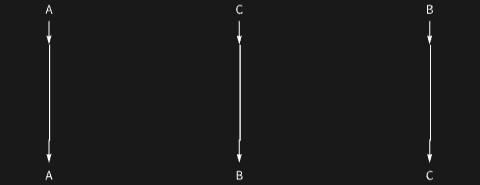

## Diagrams and Tensors

A composition of symbolic processes reads directly as matrix algebra. The <code>"Tensor"</code> property of a diagram extracts the contraction:

```wl
ColumnDiagram[{Diagram[A, a, b], Diagram[B, b, c], Diagram[C, c, d]}]["Tensor"]
```

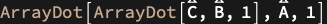

In the other direction, <code>[TensorDiagram](https://resources.wolframcloud.com/PacletRepository/resources/Wolfram/DiagrammaticComputation/ref/TensorDiagram)</code> turns a tensor expression into a diagram. A contraction of two arrays over two indices:

```wl
TensorDiagram[ArrayDot[ArraySymbol[A, {6, 5, 2, 3}], ArraySymbol[B, {2, 3, 4}], 2]]
```

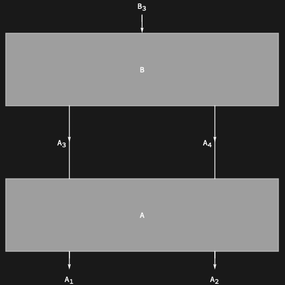

The round trip preserves the network:

```wl
d1 = DiagramNetwork[Diagram[A, a, b], Diagram[B, b, a]]
```

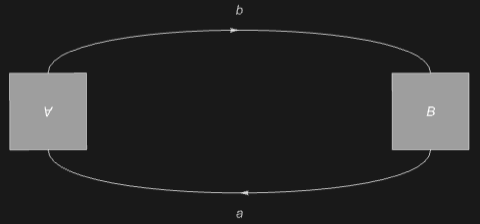

```wl
tensor = DiagramTensor[d1]
```

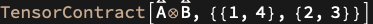

```wl
TensorDiagram[tensor]
```

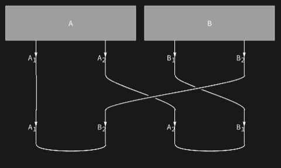

Diagrams whose labels carry concrete arrays evaluate numerically:

```wl
d2 = DiagramComposition[
  DiagramNetwork[
    Diagram[Interpretation["A", RandomReal[1, {2, 3}]], a, b],
    Diagram[Interpretation["B", RandomReal[1, {2, 3, 4}]], {b, c}, a]
  ],
  Diagram[Interpretation["C", {1., 2., 3., 4.}], c]
]
```

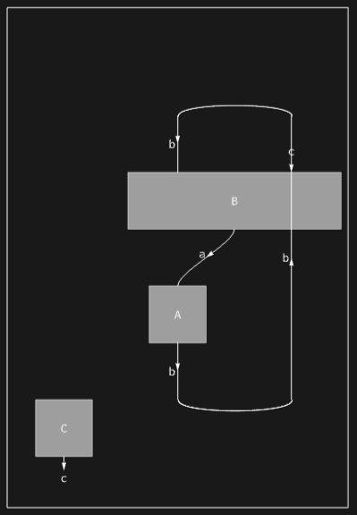

## Trees and Graphs as Grids

<code>[ToDiagram](https://resources.wolframcloud.com/PacletRepository/resources/Wolfram/DiagrammaticComputation/ref/ToDiagram)</code> converts trees and graphs to diagram networks, and the grid renderer can lay them out like an org chart by switching off wires and ports:

```wl
DiagramGrid[ToDiagram[RulesTree[1 -> {2 -> {3, 4 -> {5 -> {6, 7}}}, 4 -> {8 -> {9 -> {10}}}}]],
  Alignment -> Center, Dividers -> All, "Wires" -> False, "Shape" -> None,
  "Arrange" -> False, "PortArrows" -> None, "PortLabels" -> None]
```

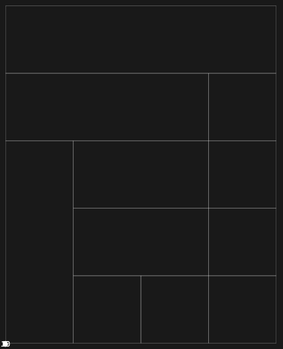

A graph becomes a network of vertex diagrams joined along its edges:

```wl
SeedRandom[7];
ToDiagram[RandomGraph[{5, 7}]]
```

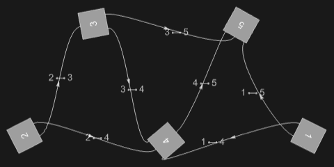

The network's grid arrangement introduces the necessary caps, cups and crossings automatically:

```wl
DiagramGrid[DiagramArrange[ToDiagram[RandomGraph[{5, 7}]]], "Outline" -> True]
```

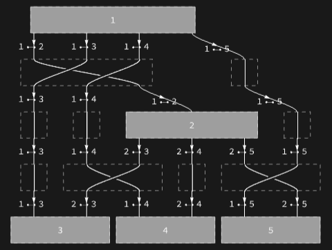

## Executable Dataflow with Parallelism

Annotated diagrams run as functions (see the introduction tech note). Functions in independent branches can run on parallel kernels:

```wl
parallel = DiagramProduct[
  Diagram[Annotation["f", "Function" -> ({{$KernelID, #1}} &)], a, b],
  Diagram[Annotation["g", "Function" -> ({{$KernelID, #1, #2}} &)], {x, z}, z]
]
```

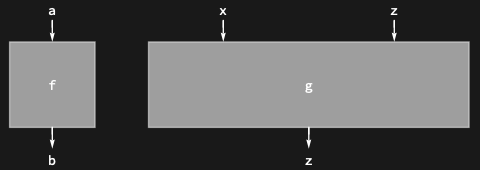

```wl
DiagramFunction[parallel]
```

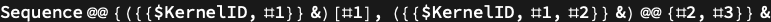
