Diagrammatic Computation involves representing operations and their connections visually, much like diagrams in mathematics or engineering. This approach emphasizes modular building blocks that can be composed in various ways to model complex systems. To illustrate these concepts computationally, we start by loading the paclet:

```wl
PacletInstall["Wolfram/DiagrammaticComputation"]
```

```wl
<< Wolfram`DiagrammaticComputation`
```

## Core Ideas of Diagrammatic Thinking

At its essence, diagrammatic computation treats computations as abstract structures: boxes representing operations, with ports for inputs and outputs. These can be wired together to form larger diagrams, revealing patterns and relationships that might be less apparent in linear code. The focus is on composition, modularity, and visualization, rather than specific applications.

## Constructing a Diagram

Consider representing addition with two inputs $x$ and $y$ and one output $z$:

```wl
Diagram[Plus, {x, y}, z]
```

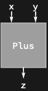

This creates a symbolic diagram: a box labeled <code>[Plus](https://reference.wolfram.com/language/ref/Plus.html)</code> with input ports $x$ and $y$, and a single output port $z$. It remains unevaluated, serving as a blueprint. By default, such diagrams format visually, showing wires connecting the ports to the operation.

There are a few custom shapes that will be useful for changing diagram default appearance:

```wl
Diagram["", a, b, "Shape" -> #] & /@ {Automatic, "RoundedRectangle", "Triangle", "UpsideDownTriangle", "Disk", "Point", "Wire"}
```

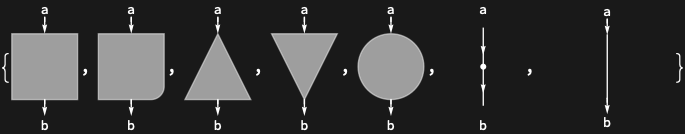

## Vertical and Horizontal Composition

Vertical composition connects diagrams end-to-end, with outputs from one feeding inputs to the next, mirroring function composition. Matching port labels enable automatic wiring.

Consider numerical operations: one doubles a number, another increments it by 1:

```wl
double = Diagram["[2\[Times]]", x, y]
```

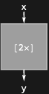

```wl
increment = Diagram["[+1]", y, z]
```

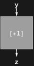

Vertical composition (increment after double):

```wl
DiagramComposition[increment, double]
```

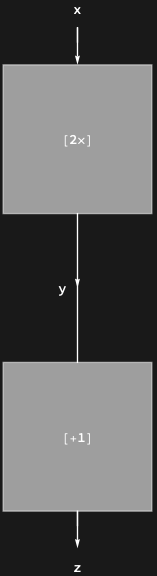

<code>[DiagramRightComposition](https://resources.wolframcloud.com/PacletRepository/resources/Wolfram/DiagrammaticComputation/ref/DiagramRightComposition)</code> composes vertically in reverse:

```wl
DiagramRightComposition[double, increment, "Rotate" -> Right]
```

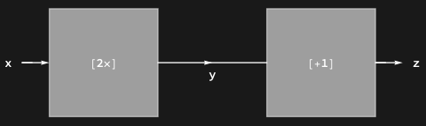

This connects $y$ from double to $y$ in increment. The rendering shows stacked boxes connected by a wire. Using standard sequential <code>[Composition](https://reference.wolfram.com/language/ref/Composition.html)</code> (<code>@*</code>) this can be represented like this:

```wl
("[+1]" @* "[2\[Times]]")@3
```


Or using <code>[RightComposition](https://reference.wolfram.com/language/ref/RightComposition.html)</code> (<code>/*</code>) producing the same expression:

```wl
("[2\[Times]]" /* "[+1]")@3
```

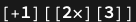

If abstract nodes are replaced by actual functions, this would produce the expected result. For input 3, double produces 6, increment yields 7:

```wl
((y |-> 2 y) /* (x |-> x + 1))@3
```

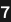

We'll create function representations of diagrams like this and more complex ones automatically later. But for now, let's try to compose these diagrams in the opposite order:

```wl
DiagramComposition[double, increment]
```

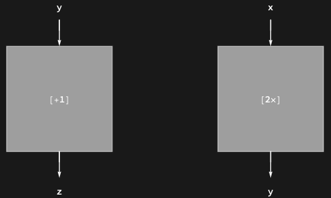

The result may be unexpected because port $z$ is followed by port $x$, which do not match, so the diagrams compose horizontally in parallel. To fix this, it is possible to reassign ports for a diagram. For example, a new double diagram with adjusted port names can be constructed like this:

```wl
double2 = Diagram[double, z, x]
```

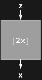

With the new input port name matching the output of the incrementing diagram, composition works correctly:

```wl
DiagramComposition[double2, increment]
```

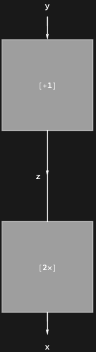

Which, after turning into a function, would produce a different result:

```wl
((z |-> z + 1) /* (y |-> 2 y))@3
```

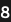

The parallel composition above can also be done directly using <code>[DiagramProduct](https://resources.wolframcloud.com/PacletRepository/resources/Wolfram/DiagrammaticComputation/ref/DiagramProduct)</code> in any order; this ensures that ports of horizontally composed diagrams never wire together:

```wl
DiagramProduct[increment, double]
```


```wl
DiagramProduct[double, increment]
```

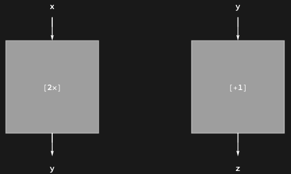

These diagrams also show that, in principle, diagrams can have multiple inputs and multiple outputs:

```wl
Diagram[f, {x, y}, {a, b, c}]
```

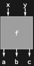

This also includes zero inputs and/or zero outputs:

```wl
{Diagram[x, a], Diagram[x, a, {}], Diagram[x]}
```

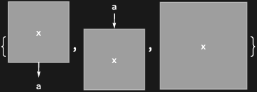

For example, the input to a computation can be represented as a diagram with no inputs:

```wl
three = Diagram[3, x]
```

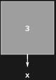

And it can also be used in a composition to diagrammatically represent the whole computation:

```wl
DiagramComposition[increment, double, three]
```

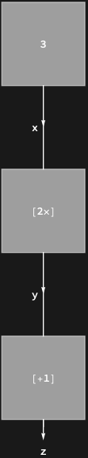

## Diagram Functions

Building on simple compositions, we can create more intricate compositions by combining vertical and horizontal arrangements, introducing branching and merging. This allows modeling workflows with parallel paths that diverge and reconverge, such as processing a number through multiple operations before combining results.

To turn diagrams into functions, the symbolic label has to be annotated with functional code, for example:

```wl
add = Diagram[Annotation["[+]", "Function" -> Plus], {s, t}, result]
```

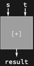

Given this more verbose diagram, we can turn it into a function:

```wl
DiagramFunction[add]
```


With such function annotations it is possible to build a more complex diagram, now using more convenient <code>[ColumnDiagram](https://resources.wolframcloud.com/PacletRepository/resources/Wolfram/DiagrammaticComputation/ref/ColumnDiagram)</code> and <code>[RowDiagram](https://resources.wolframcloud.com/PacletRepository/resources/Wolfram/DiagrammaticComputation/ref/RowDiagram)</code> constructors:

```wl
{
  three = Diagram[Annotation["3", "Function" -> (3 &)], input],
  double = Diagram[Annotation["[2\[Times]]", "Function" -> (2 # &)], input, doubled],
  copy = Diagram[Annotation["", "Function" -> (Sequence @@ {#, #} &)], doubled, {a, b}, "Shape" -> "Point"],
  increment = Diagram[Annotation["[+1]", "Function" -> (# + 1 &)], a, incremented],
  square = Diagram[Annotation["[^2]", "Function" -> (#^2 &)], b, squared],
  add = Diagram[Annotation["[+]", "Function" -> Plus], {incremented, squared}, result]
}
```

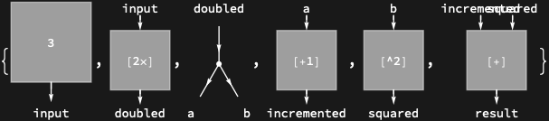

```wl
diagram = ColumnDiagram[{
  three,
  double,
  copy,
  RowDiagram[{increment, square}],
  add
}, Alignment -> Center]
```

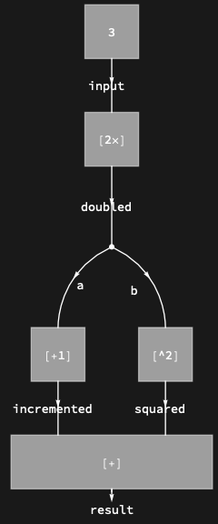

Input 3 doubles to 6, one copy is incremented to 7 and another squared to 36, which then adds to 43:

```wl
diagramFunction = DiagramFunction[diagram]
```

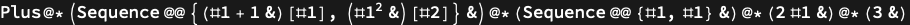

```wl
diagramFunction[]
```

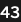

By default it is assumed that functions take a sequence and output a sequence, but both input and output can also be either a <code>[List](https://reference.wolfram.com/language/ref/List.html)</code> or an <code>[Association](https://reference.wolfram.com/language/ref/Association.html)</code>.

The <code>[List](https://reference.wolfram.com/language/ref/List.html)</code> output would be <code>[Indexed](https://reference.wolfram.com/language/ref/Indexed.html)</code> and <code>[Association](https://reference.wolfram.com/language/ref/Association.html)</code> would incorporate port expressions as keys:

```wl
doubleIncrementList = Diagram[Annotation["[2\[Times]]", "Function" -> ({2 #, # + 1} &), "Type" -> "Sequence" -> "List"], x, {y, z}]
```

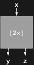

```wl
listFunction = DiagramFunction[doubleIncrementList, "Input" -> "List", "Output" -> "List"]
```

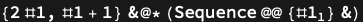

```wl
listFunction[{3}]
```

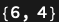

```wl
assocFunction = DiagramFunction[doubleIncrementList, "Input" -> "Association", "Output" -> "Association"]
```


```wl
assocFunction[<|x -> 3|>]
```

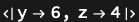

## Diagram Networks

Rather than arranging diagrams in a grid-like fashion, there is a more flexible way to wire arbitrary ports using <code>[DiagramNetwork](https://resources.wolframcloud.com/PacletRepository/resources/Wolfram/DiagrammaticComputation/ref/DiagramNetwork)</code>, which connects all equivalent ports independent of their position within or across all diagrams.

For example it is possible to create a loop by wiring input and output together:

```wl
DiagramNetwork[Diagram[A, a, a]]
```

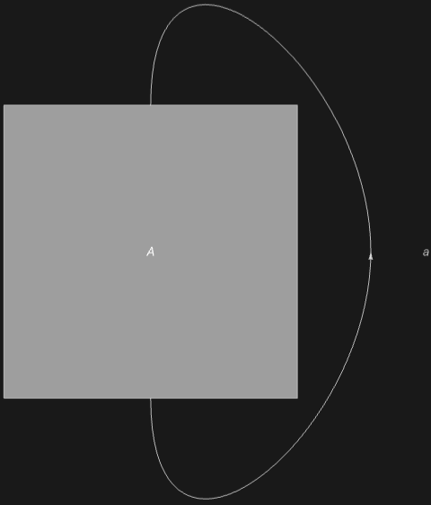

Or a loop that includes more than one diagram:

```wl
DiagramNetwork[Diagram[A, a, b], Diagram[B, b, c], Diagram[C, c, a]]
```

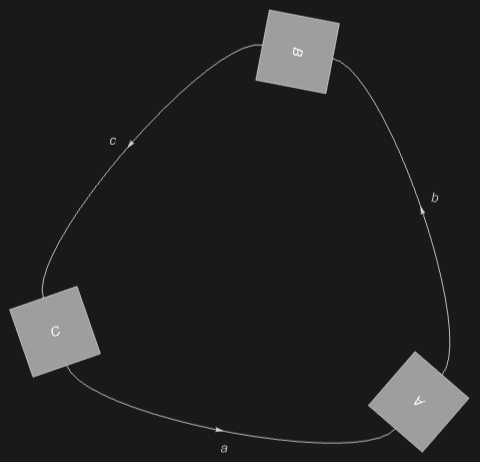

It is always possible to arrange such networks into a grid by introducing special "u-turn" diagrams, conventionally named caps and cups:

```wl
DiagramGrid[DiagramNetwork[Diagram[A, a, b], Diagram[B, b, c], Diagram[C, c, a]], "Outline" -> True]
```

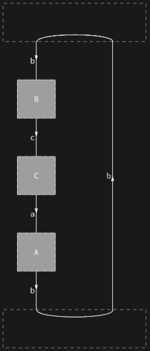

```wl
DiagramGrid[DiagramArrange[DiagramNetwork[Diagram[A, {x, a}, b], Diagram[B, b, c], Diagram[C, c, {y, a}]]], "Outline" -> True]
```

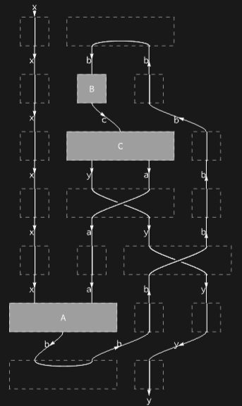

### Wire Diagrams

String diagrams include special diagrams which have some string properties and act as a generalization of identity diagram weaving single wires:

```wl
IdentityDiagram[a]
```

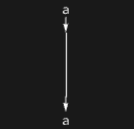

```wl
IdentityDiagram[{a, b} -> {x, y}]
```

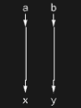

```wl
PermutationDiagram[{a, b} -> {b, a}]
```

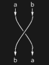

```wl
CupDiagram[a]
```

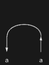

```wl
CapDiagram[a]
```

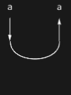

In addition there are some diagrams that have a special role in process theories and behave like arbitrary input/output generalization of identity:

```wl
CopyDiagram[x]
```

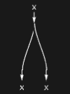

```wl
SpiderDiagram[{a, b, c, d}, {x, y, z}]
```

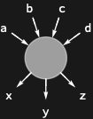

## Diagram Surgery

Diagrams have hierarchical structure and can be decomposed into their constituents in multiple ways.

```wl
diag = Diagram[(Diagram[A, a, c] \[CircleTimes] Diagram[B, b]) /* Diagram[C, {c, b}, e]]
```

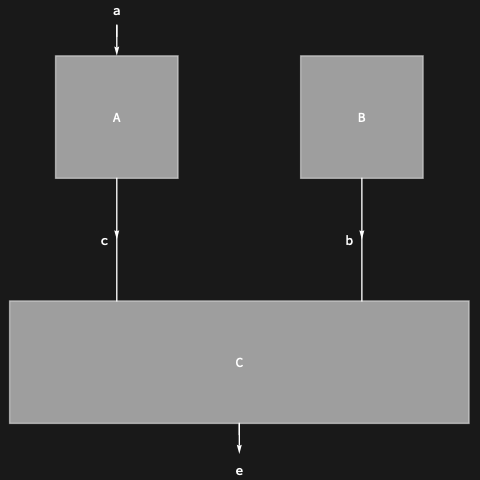

Decompose into a tree-like expression consisting of diagram nodes only:

```wl
DiagramDecompose[diag]
```

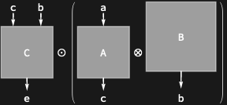

```wl
DiagramPositions[diag]
```

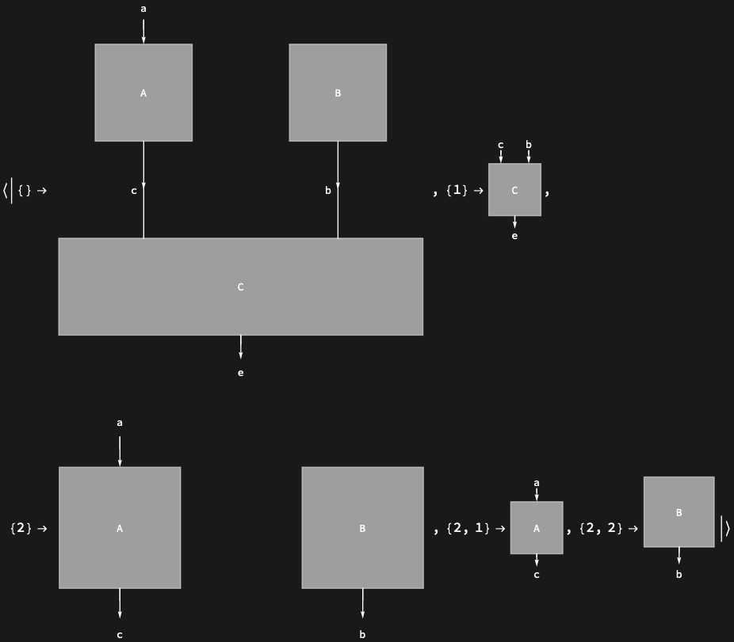

Apply a function to every subdiagram with <code>[DiagramMap](https://resources.wolframcloud.com/PacletRepository/resources/Wolfram/DiagrammaticComputation/ref/DiagramMap)</code>:

```wl
DiagramMap[Diagram[#, "Expression" -> RandomColor[]] &, diag]
```

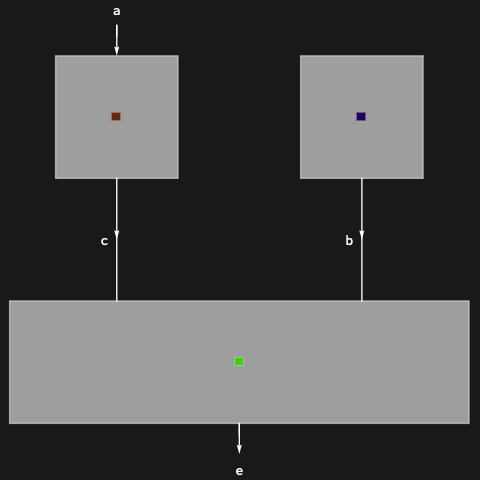

Or only at a specific position with <code>[DiagramMapAt](https://resources.wolframcloud.com/PacletRepository/resources/Wolfram/DiagrammaticComputation/ref/DiagramMapAt)</code>:

```wl
DiagramMapAt[Diagram[#, "Expression" -> RandomColor[]] &, diag, {2}]
```

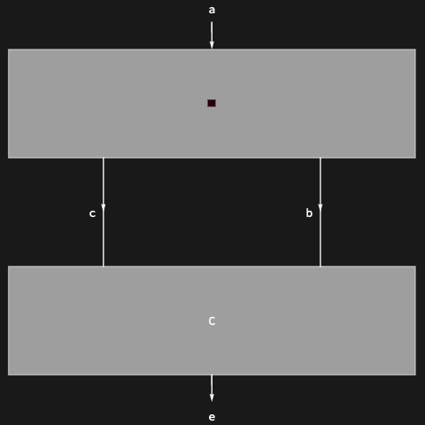

## Diagram Tensors

Wire diagrams have special representations as tensors:

```wl
DiagramTensor[IdentityDiagram[a]]
```


```wl
DiagramTensor[PermutationDiagram[{b, a}]]
```

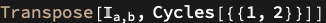

```wl
DiagramTensor[CapDiagram[a]]
```

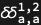
