Diagram rewriting replaces a piece of a diagram matching a pattern with another piece, reconnecting the wires. Matching happens on the diagram's hypergraph structure, so rules are insensitive to layout and port naming -- formal pattern symbols in port positions bind to whatever wiring the match finds. This tech note builds rewrite rules for algebraic laws and applies them with <code>[DiagramReplaceList](https://resources.wolframcloud.com/PacletRepository/resources/Wolfram/DiagrammaticComputation/ref/DiagramReplaceList)</code> and <code>[DiagramReplace](https://resources.wolframcloud.com/PacletRepository/resources/Wolfram/DiagrammaticComputation/ref/DiagramReplace)</code>.

```wl
<< Wolfram`DiagrammaticComputation`
```

## Structural Rules

A rewrite rule is a <code>[Rule](https://reference.wolfram.com/language/ref/Rule.html)</code> between two diagrams whose ports carry patterns. Associativity of a binary operation $f$ rewires the parenthesisation of a double application:

```wl
associativity = DiagramComposition[Diagram[f_, {p_, p3_}, p4_], Diagram[f_, {p1_, p2_}, p_]] ->
  DiagramComposition[Diagram[f, {p1, p}, p4], Diagram[f, {p2, p3}, p]]
```

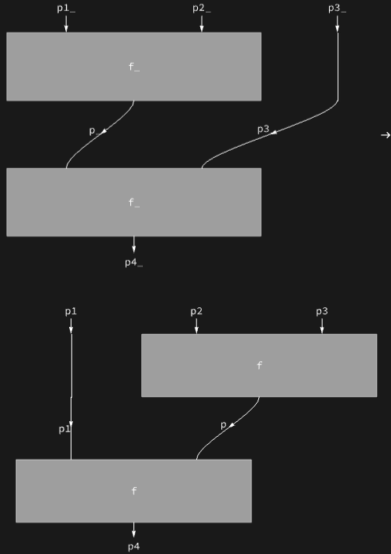

Coassociativity is the mirror law for a binary cooperation:

```wl
coassociativity = DiagramComposition[Diagram[f_, p_, {p2_, p3_}], Diagram[f_, p1_, {p_, p4_}]] ->
  DiagramComposition[Diagram[f, p, {p3, p4}], Diagram[f, p1, {p2, p}]]
```

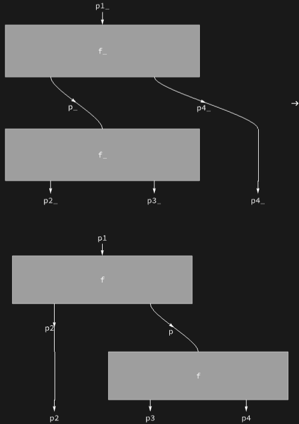

## Applying Rules

A tree of binary operations $A$ and cooperations $B$ to rewrite:

```wl
diag = Diagram[DiagramRightComposition[
  DiagramProduct[Diagram[C, p], DiagramComposition[Diagram[B, p, {p, p}], Diagram[B, p, {p, p}]]],
  DiagramComposition[Diagram[A, {p, p}, p], DiagramProduct[Diagram[A, {p, p}, p], IdentityDiagram[p]]],
  Diagram[D, p, p]]]
```

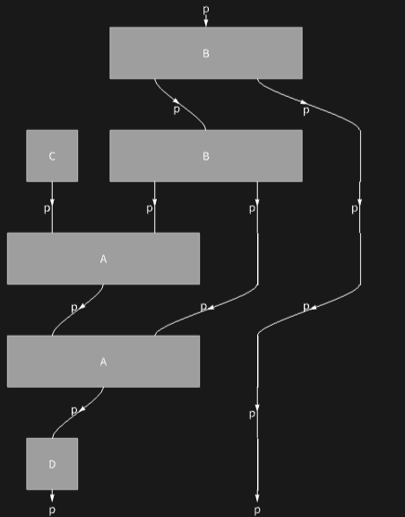

<code>[DiagramReplaceList](https://resources.wolframcloud.com/PacletRepository/resources/Wolfram/DiagrammaticComputation/ref/DiagramReplaceList)</code> enumerates every possible single application of the rule:

```wl
DiagramReplaceList[diag, associativity]
```

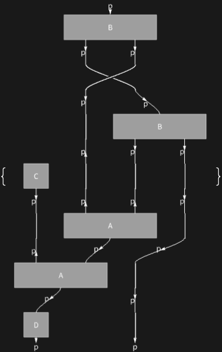

Several rules can be tried at once:

```wl
DiagramReplaceList[diag, {associativity, coassociativity}]
```

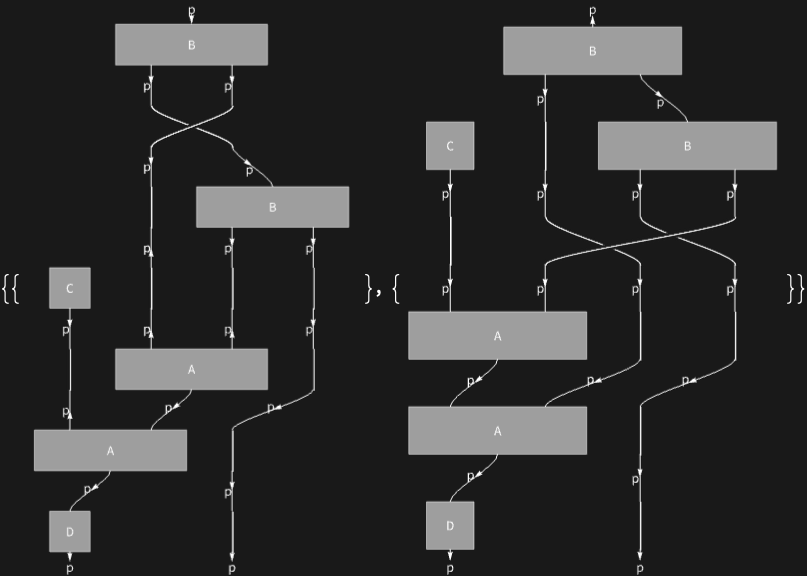

<code>[DiagramReplace](https://resources.wolframcloud.com/PacletRepository/resources/Wolfram/DiagrammaticComputation/ref/DiagramReplace)</code> applies the first match only:

```wl
DiagramReplace[diag, associativity]
```

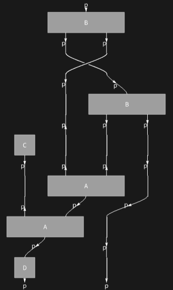

And <code>[DiagramNestReplace](https://resources.wolframcloud.com/PacletRepository/resources/Wolfram/DiagrammaticComputation/ref/DiagramNestReplace)</code> iterates rules a given number of times:

```wl
DiagramNestReplace[diag, {associativity, coassociativity}, 2]
```

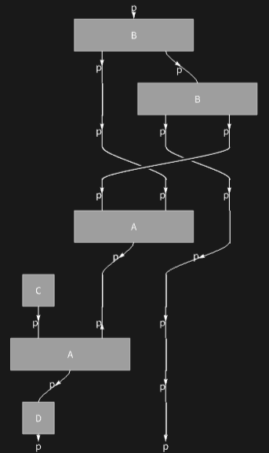

## Interaction-Net Rules

The paclet provides constructors for the standard interaction-net rule schemas. Two facing copy nodes annihilate into parallel wires:

```wl
DuplicateAnnihilationRule[{x1, x2}, {y1, y2}]
```

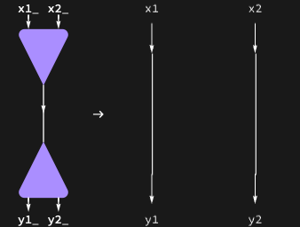

A node commutes past a copy node, duplicating itself:

```wl
CommutationRule[{x1, SuperStar[x2]}, {y1, y2}]
```

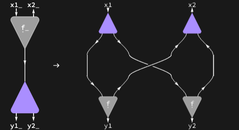

An eraser propagates through a process, erasing it port by port:

```wl
EraserRule[{SuperStar[x], y}]
```

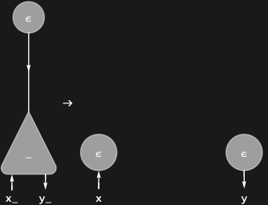

Erasing one branch of a copy leaves a plain wire:

```wl
DuplicateEraserRule[x, y]
```

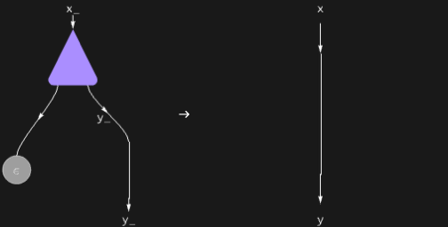

These rules drive lambda-calculus evaluation as interaction nets: beta reduction is an annihilation between a lambda node and an application node, and copy/erase rules implement sharing and garbage collection.

## Inspecting the Matcher

Rules are matched against the hypergraph view of the diagram. <code>[DiagramHypergraph](https://resources.wolframcloud.com/PacletRepository/resources/Wolfram/DiagrammaticComputation/ref/DiagramHypergraph)</code> exposes it:

```wl
DiagramHypergraph[diag]
```

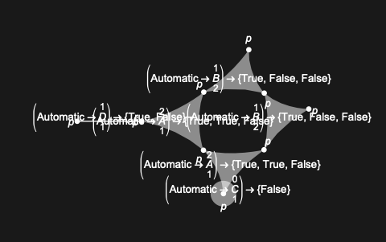

And <code>[DiagramHypergraphRule](https://resources.wolframcloud.com/PacletRepository/resources/Wolfram/DiagrammaticComputation/ref/DiagramHypergraphRule)</code> shows how a rule is presented to the matching engine:

```wl
DiagramHypergraphRule[associativity]
```

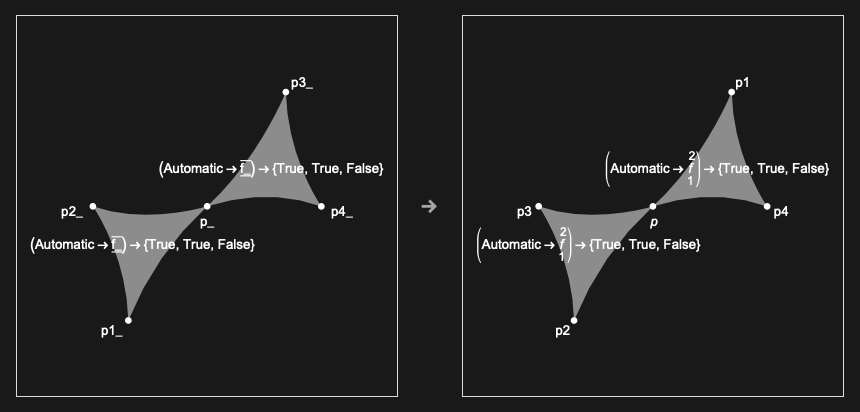
